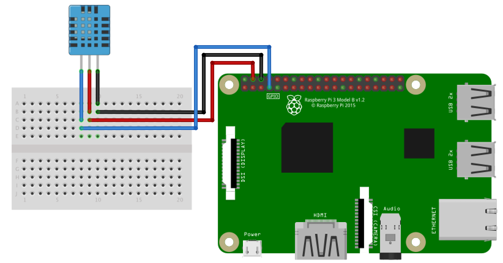

This is a quick IoT example using the Fauna.com cloud database.  `write_to_fauna.py` reads data from a temperature and humidity sensor and stores it in Fauna, while `read_from_fauna.py` pulls the data back from Fauna and displays it on the command line.

All temperature data is in Celcius.

### Required Parts:
* Raspberry Pi computer.
* DHT11 environmental sensor - a 3-pin sensor is used in this example, but a DHT22 or 4-pin DHT11 will work just as well.
* Jumper wires and breadboard.

### Fauna
Follow the "[Quick start with Fauna Cloud](https://docs.fauna.com/fauna/current/start/cloud.html)" docs to create a database named "environmental" with a class named "readings".
An index named "all_readings" should be automatically generated for you.

Under "Keys" or "New child DB key", create a new Server type key for the "environmental" database.  Pass the key as a --secret parameter to the scripts.

### Hardware
Connect a DHT11 environmental sensor to your Raspberry Pi as shown:

### Code
Download and install the [Adafruit Python DHT Library](https://github.com/adafruit/Adafruit_Python_DHT) to read the sensor.
Download and install the [Fauna Python Driver](https://github.com/fauna/faunadb-python) to handle the Fauna connection.

### Run
`python write_to_fauna.py --secret=FAUNA_SECRET`
`python read_from_fauna.py --secret=FAUNA_SECRET`

### Troubleshooting
If the Fauna query fails, verify your database secret and Fauna setup.

If the Fauna query succeeds, but the values are empty, check the physical connection to the DHT sensor and ensure you have the correct data pin set.

For further assistance, reach out to us on the [Fauna Community Slack Channel](https://community-invite.fauna.com/).